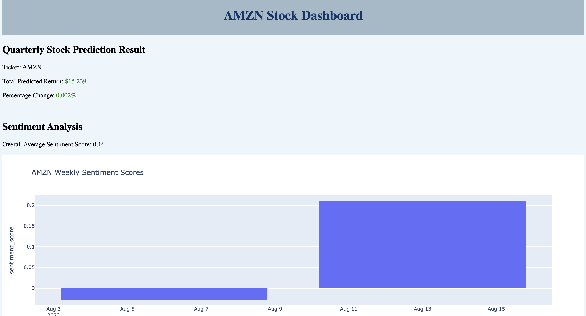
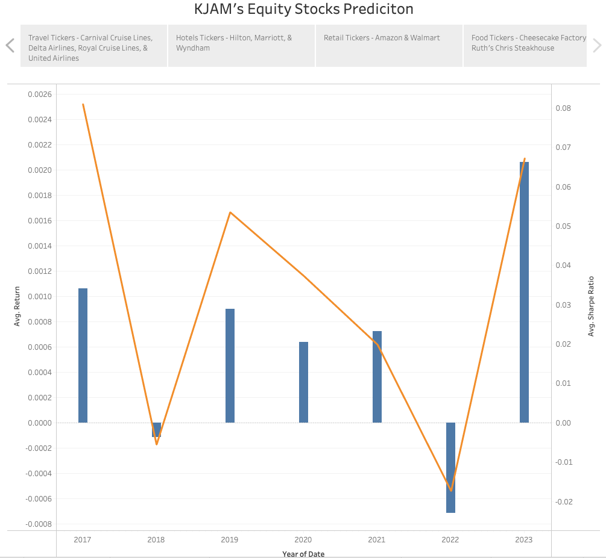

# Project_4_k-Jam
Our team (KJAM Equity) has utilized data analytics tools and processes (e.g., machine learning) to analyze how COVID-19 has impacted the financial returns of certain sector stocks.  Specifically, we decided to analyze the travel, hospitality & retail industries (three industries assumed to be impacted by COVID-19) by sampling the following stocks (below):
* Amazon (AMZN)
* Cheesecake Factory (CAKE)
* Carnival (CCL)
* Delta (DAL)
* Hilton (HLT)
* Marriott (0JYW)
* Royal Caribbean (RCL)
* Ruth’s Chris Steakhouse (RUTH)
* United (UAL)
* Wyndam (WH)
* Walmart (WMT)

### Goal:
To develop a dashboard where users can choose a specific stock, input purchase volume and price of the stock and determine expected return (daily & quarterly) for that stock based on historical data.  The dashboard also includes a “sentiment analysis” that allows the user to see if the stock has positive or negative connotation (e.g., recent past news articles, etc.) in current events.

### Data:  
We utilized seven years of data (2017-2023) consisting of ~17,600 rows; our assumption is that “pre” COVID-19 is 2017 – 2021 and “post” COVID-19 is 2022-2023.  

### Result:
Below is a static snapshot of the dashboard:

### Tools Utilized:
1. SQLite DB -> Python (store data)
2.  Random Forrest (RF) Model -> Jupyter Notebooks
3.  FinViz (stock screener) -> Natural Language Toolkit (NLTK)/ Valence Aware Dictionary for Sentiment Reasoning (VADER) (sentiment analysis)
4.  Long Short Term (LSTM) Model -> CoLab 
5.  Models -> Flask -> HTML (dashboard)
6.  Tableau – data visualization

### Analysis:
1.  Random Forest (RF) model (avg. quarterly data) =
*    predict quarterly stock return (volume, Sharpe Ratio “index - return vs. risk of an investment”)
*   initial linear regression no good
2.  Sentiment analysis tool (Python) = 
*   short-term score for each stock 
3.  Long Short-Term Memory (LSTM) model (daily stock price data) = 
*  predict daily stock returns
*   initial Multiclass Perceptron (MLP) model (classification model no good)
4.  Flask routes, chatbot on a webpage (stock name, daily price & volume) = 
*    Dashboard = future daily, quarterly returns + overall sentiment score 

### Conclusions:
1.  Quarterly model (w/ sentiment analysis included) best for predictions
2.  Linear regression model not suited well for time-series data (x vs. y variable varies over time) 
3.  Daily stock data too noisy for deep learning (separate model for each stock recommended)
4.  Significant post COVID-19 recovery and growth for travel stocks
